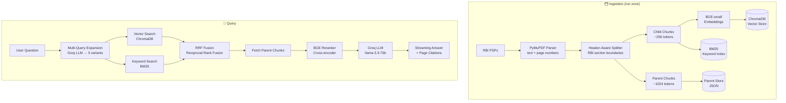

# FinQuery — RAG over RBI Regulatory Documents


> Ask questions about Indian financial regulations in plain English — get precise, cited answers grounded in the exact RBI source document and page. No hallucination. No knowledge cutoff.

---

## Demo

> *Add a demo GIF here — see instructions at the bottom of this README*

---

## Why This Exists

RBI issues 100+ circulars annually. General LLMs have a knowledge cutoff and miss recent ones. Hallucination risk is unacceptable in regulatory contexts. FinQuery answers must cite the exact document and page so users can verify — making every answer audit-trail ready.

---

## Sample Queries

<details>
<summary><b>Q: What is MCLR and how should banks calculate it?</b></summary>

> The Marginal Cost of Funds based Lending Rate (MCLR) is an internal benchmark for floating rate rupee loans. It comprises four components: marginal cost of funds, negative carry on CRR, operating costs, and tenor premium **[Source 1, Page 5]**.
>
> To calculate MCLR, banks must:
> 1. Calculate marginal cost of funds — including marginal cost of borrowings and return on networth **[Source 1, Page 6]**
> 2. Add negative carry on CRR using: `Required CRR × (marginal cost) / (1 - CRR)` **[Source 1, Page 6]**
> 3. Include all operating costs associated with providing the loan product **[Source 1, Page 6]**
> 4. Add a tenor premium for longer-tenor loan commitments **[Source 1, Page 6]**
>
> Banks must review and publish MCLR for overnight, 1-month, 3-month, 6-month, and 1-year maturities every month on a pre-announced date **[Source 2, Page 7]**.
>
> **Sources:** Master Direction – Interest Rate on Advances, Pages 5, 6, 7

</details>

<details>
<summary><b>Q: What are the key requirements for digital lending apps under RBI guidelines?</b></summary>

> Digital lending apps must comply with the following under RBI's Digital Lending Guidelines 2022:
> - Ensure all loan disbursals go directly to the borrower's bank account — no pass-through via LSP accounts **[Source 1, Page 3]**
> - Collect only need-based data with prior and explicit borrower consent **[Source 1, Page 3]**
> - Comply with minimum cybersecurity baseline with end-to-end encryption, geo-tagging, and face liveness/spoof detection **[Source 2, Page 9]**
> - Disclose the Annual Percentage Rate (APR) to borrowers before loan execution **[Source 3, Page 4]**
> - Provide a cooling-off/look-up period during which the borrower can exit without penalty **[Source 3, Page 4]**
>
> **Sources:** Digital Lending Guidelines 2022, Pages 3, 4, 9

</details>

<details>
<summary><b>Q: What are the NPA classification timelines for advances?</b></summary>

> Under the Master Circular on IRACP Norms 2021, a Non-Performing Asset (NPA) is a loan or advance where:
> - Interest or principal has remained overdue for more than **90 days** in the case of a term loan **[Source 1]**
> - The account remains "out of order" for more than 90 days in the case of an overdraft/cash credit **[Source 1]**
> - Any amount due remains unpaid for more than 90 days in the case of bills purchased/discounted **[Source 1]**
>
> Once classified as NPA, further sub-classification applies:
> - **Sub-standard**: NPA for up to 12 months **[Source 2]**
> - **Doubtful**: Sub-standard for more than 12 months **[Source 2]**
> - **Loss**: Where loss has been identified but not fully written off **[Source 2]**
>
> **Sources:** Master Circular – IRACP Norms 2021

</details>

<details>
<summary><b>Q: What data can a digital lending app collect from a borrower?</b></summary>

> Under RBI's Digital Lending Guidelines 2022, data collection by lending apps is strictly need-based:
> - Apps may collect only data that is **necessary for the credit product** being offered **[Source 1, Page 3]**
> - Collection requires **prior and explicit consent** from the borrower, with a clear audit trail **[Source 1, Page 3]**
> - One-time access is permitted for camera, microphone, and location — **persistent access is not allowed** **[Source 2, Page 9]**
> - Access to phone contacts, media files, or call logs is **prohibited** **[Source 2, Page 9]**
>
> **Sources:** Digital Lending Guidelines 2022, Pages 3, 9

</details>

---

## Architecture



### Techniques Implemented

| Technique | Why It Matters |
|---|---|
| **Header-aware chunking** | Preserves RBI section boundaries — chunks stay semantically complete |
| **Parent-child retrieval** | Retrieves small chunks (precision), sends large chunks to LLM (context) |
| **Hybrid search** (BM25 + vector) | Vector misses exact terms like "Section 42" or "NBFC-MFI" — BM25 catches them |
| **Reciprocal Rank Fusion** | Merges two ranked lists without needing score normalisation |
| **Multi-query expansion** | 3 query variants → catches paraphrased content, boosts recall |
| **BGE cross-encoder reranking** | Second-pass precision: re-scores candidates using query-aware attention |
| **Streaming responses** | Token-by-token delivery — production UX pattern |
| **Page-level citations** | Every answer cites document name + page — audit-trail ready |
| **MD5 embedding cache** | Skips re-processing already-indexed PDFs on restart |
| **RAGAS evaluation** | Synthetic Q&A generation + faithfulness, relevancy, precision, recall scoring |

---

## Evaluation (RAGAS)

RAGAS auto-generates Q&A pairs from the documents — no manual labelling — and scores the full pipeline:

| Metric | What It Measures |
|---|---|
| `faithfulness` | Is the answer grounded in retrieved context? (anti-hallucination) |
| `answer_relevancy` | Does the answer actually address the question? |
| `context_recall` | Did retrieval surface all relevant information? |
| `context_precision` | Were the retrieved chunks ranked well? |

> *Run `python -m src.evaluation.evaluate --testset-size 10` to generate your scores.*

---

## Knowledge Base (6 RBI Documents)

| Document | Pages | Topics |
|---|---|---|
| KYC Master Direction 2016 (updated Aug 2025) | 107 | Identity verification, AML, CDD, e-KYC |
| Digital Lending Guidelines 2022 | 12 | Lending apps, LSPs, APR, data privacy |
| Master Circular – IRACP Norms 2021 | 77 | NPA classification, provisioning, upgrades |
| Master Direction – Interest Rate on Advances | 20 | MCLR, base rate, tenor, floating rates |
| Fraud Risk Management FAQs 2024 | 2 | Fraud classification, SCBMF, reporting |
| Tax Collection Scheme Circular 2016 | 4 | Agency bank collection duties |

---

## Tech Stack

| Layer | Tool | Why Free |
|---|---|---|
| LLM | Groq `llama-3.3-70b-versatile` | Free tier — 100k tokens/day |
| Embeddings | `BAAI/bge-small-en-v1.5` | Runs locally — no API needed |
| Reranker | `BAAI/bge-reranker-base` | Runs locally — no API needed |
| Vector DB | ChromaDB | Persists to disk — no server |
| Keyword search | `rank_bm25` | Pure Python — no infra |
| PDF parsing | PyMuPDF | Open source |
| Framework | LangChain | Open source |
| UI | Streamlit | Open source |
| Evaluation | RAGAS | Open source |

**Total infrastructure cost: $0**

---

## Project Structure

```
finquery/
├── data/
│   ├── raw/              ← RBI PDFs (add your own)
│   ├── chroma_db/        ← Vector store (auto-created on ingest)
│   ├── bm25_index/       ← BM25 index  (auto-created on ingest)
│   └── cache/            ← Embedding cache + parent chunk store
├── src/
│   ├── config.py                    ← All env vars in one place
│   ├── ingestion/
│   │   ├── pdf_parser.py            ← PyMuPDF + TOC detection
│   │   ├── chunker.py               ← Header-aware + parent-child
│   │   └── indexer.py               ← ChromaDB + BM25 + MD5 cache
│   ├── retrieval/
│   │   ├── hybrid_search.py         ← Vector + BM25 + RRF
│   │   └── reranker.py              ← BGE cross-encoder
│   ├── generation/
│   │   ├── query_expander.py        ← Multi-query via Groq
│   │   └── generator.py             ← Prompt + streaming + citations
│   └── evaluation/
│       └── evaluate.py              ← RAGAS synthetic testset + scoring
├── app.py                ← Streamlit chat UI
├── ingest.py             ← CLI: python ingest.py
├── .env.example          ← Copy to .env and add your key
└── requirements.txt
```

---

## Setup & Run

```bash
# 1. Clone
git clone https://github.com/supreetsingh672/finquery.git
cd finquery

# 2. Create virtual environment (Python 3.11 recommended)
python3.11 -m venv .venv
source .venv/bin/activate      # Windows: .venv\Scripts\activate

# 3. Install dependencies
pip install -r requirements.txt

# 4. Set your Groq API key (free at console.groq.com)
cp .env.example .env
# Edit .env → set GROQ_API_KEY=your_key_here

# 5. Add RBI PDFs to data/raw/ and ingest
python ingest.py

# 6. Run the app
streamlit run app.py
```

---

## Environment Variables

| Variable | Default | Description |
|---|---|---|
| `GROQ_API_KEY` | — | **Required.** Free at [console.groq.com](https://console.groq.com) |
| `GROQ_MODEL` | `llama-3.3-70b-versatile` | LLM for answer generation |
| `EMBEDDING_MODEL` | `BAAI/bge-small-en-v1.5` | Local embedding model |
| `RERANKER_MODEL` | `BAAI/bge-reranker-base` | Local reranker |
| `TOP_K_RETRIEVAL` | `10` | Candidates fetched before reranking |
| `TOP_K_RERANK` | `4` | Final chunks passed to LLM |
| `CHUNK_SIZE_CHILD` | `256` | Child chunk size (approx tokens) |
| `CHUNK_SIZE_PARENT` | `1024` | Parent chunk size (approx tokens) |

---

## Recording a Demo GIF

1. Install **Gifox** (free trial) or use **QuickTime** → trim → convert
2. Open the app at `http://localhost:8501`
3. Record yourself typing one question and waiting for the streaming answer
4. Save as `demo.gif` in the repo root
5. Add to README: `` under the Demo section above

---

*Built with LangChain · ChromaDB · Groq · RAGAS · Streamlit*
